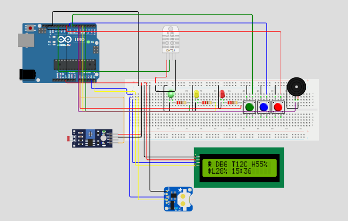

# Monitoramento Ambiental para Vinheria – Edge Computing CP2

## Montagem no Wokwi

<p align="center">
  
</p>

---

## Contexto Acadêmico

Este projeto foi desenvolvido como parte da disciplina de **Edge Computing**, com o objetivo de aplicar conceitos de coleta, processamento e tomada de decisão diretamente em dispositivos embarcados, sem depender de processamento em nuvem.

---

## Sobre o Projeto

Este projeto em **C++ para Arduino** implementa um sistema de **monitoramento ambiental em tempo real** para a **Vinheria Agnello**, controlando temperatura, umidade e luminosidade para garantir a conservação ideal dos vinhos.

O sistema utiliza:

- **Sensor DHT11** – mede temperatura e umidade do ambiente.
- **Fotoresistor (LDR)** – capta a intensidade da luz ambiente com calibração automática e média móvel.
- **LEDs (verde, amarelo e vermelho)** – indicam visualmente o status geral do ambiente.
- **Buzzer** – emite alertas sonoros intermitentes (3s ligado / 3s desligado) apenas em situações críticas.
- **Display LCD 16x2 com módulo I2C** – exibe leituras em tempo real com menu navegável de 11 telas.
- **RTC DS1307** – fornece data e hora real; com fallback para `millis()` caso o módulo não seja encontrado.
- **EEPROM interna** – salva configurações e histórico circular de até 48 registros de log.
- **3 botões (MENU, UP, DOWN)** – permitem navegar pelas telas e ajustar configurações diretamente no hardware.

---

## Equipe Debuggers – Identidade Visual

O projeto inclui uma animação de abertura personalizada da equipe **Debuggers** com ícone de alien customizado (`lcd.createChar()`), barra de progresso animada e tela de boas-vindas com o nome da vinheria.

---

## Funcionamento

1. O **LDR** realiza leitura analógica com **calibração automática** ao iniciar e **média móvel de 10 amostras** para evitar oscilações no display.
2. O **DHT11** lê temperatura e umidade a cada 2 segundos.
3. Com base nas leituras, o sistema avalia o status de cada parâmetro:
   - **Luminosidade:** 0–50% → OK | 51–75% → Atenção | >75% → Crítico
   - **Temperatura:** 10–15 °C → OK | 8–18 °C → Atenção | fora disso → Crítico
   - **Umidade:** 50–70% → OK | 40–80% → Atenção | fora disso → Crítico
4. O **status geral** corresponde ao pior entre os três parâmetros:
   - **OK** → LED verde, sem som.
   - **Atenção** → LED amarelo, sem som.
   - **Crítico** → LED vermelho + buzzer intermitente (3 s ligado / 3 s desligado).
5. O **LCD** exibe 11 telas navegáveis pelo botão MENU: resumo principal, temperatura, umidade, luminosidade, relógio, faixas ideais, último log e configurações (UTC, unidade de temperatura, logo e idioma).
6. A **EEPROM** salva um log a cada 60 segundos com timestamp, temperatura, umidade, luminosidade e status.

---

## Componentes Utilizados

| Componente                  | Quantidade |
|-----------------------------|------------|
| Arduino UNO                 | 1x         |
| Protoboard                  | 1x         |
| Sensor DHT11                | 1x         |
| LDR (fotoresistor)          | 1x         |
| Resistor de 10 kΩ (LDR)    | 1x         |
| LED Verde                   | 1x         |
| LED Amarelo                 | 1x         |
| LED Vermelho                | 1x         |
| Resistores de 220 Ω (LEDs)  | 3x         |
| Buzzer piezoelétrico        | 1x         |
| Display LCD 16x2 + módulo I2C | 1x       |
| RTC DS1307                  | 1x         |
| Botões (push button)        | 3x         |
| Jumpers macho-macho         | vários     |
| Jumpers macho-fêmea         | vários     |

---

## Bibliotecas Necessárias

Instale via **Arduino IDE → Gerenciar Bibliotecas**:

| Biblioteca            | Finalidade                      |
|-----------------------|---------------------------------|
| `Wire`                | Comunicação I2C (LCD e RTC)     |
| `LiquidCrystal_I2C`   | Display LCD com módulo I2C      |
| `RTClib`              | RTC DS1307 e classe `DateTime`  |
| `DHT sensor library`  | Sensor DHT11 / DHT22            |
| `EEPROM`              | Memória interna (nativa)        |

---

## Como Reproduzir o Projeto

### 1. Clonar o Repositório

```bash
git clone https://github.com/Tkkulesza/Edge-Computing-CP2.git
```

### 2. Carregar o Código no Arduino

Abra o arquivo `projeto.ino` na **Arduino IDE**, instale as bibliotecas listadas acima e faça o upload para a placa.

### 3. Simulação no Wokwi

Visualize e simule o circuito diretamente pelo Wokwi:

[Simulação no Wokwi](https://wokwi.com/projects/464090887882718209)

### 4. Vídeo de Demonstração

[Assistir no YouTube](https://youtu.be/dgfMLBl5Csc?si=vAHC7bF7ARXvJR6F)

---

## Integrantes

| Nome completo         | RM     | Turma  | Função        |
|-----------------------|--------|--------|---------------|
| Enrico Vidal          | 569217 | 1 ESPG | Desenvolvedor |
| Guilherme de Rosa     | 569193 | 1 ESPG | Desenvolvedor |
| Marcella Pinheiro     | 569457 | 1 ESPG | Desenvolvedor |
| Thiago Kulesza        | 568922 | 1 ESPG | Desenvolvedor |
| Vinicius Cavalcanti   | 570818 | 1 ESPG | Desenvolvedor |
| Isabella Yogui Kohara | 569777 | 1 ESPG | Desenvolvedor |
